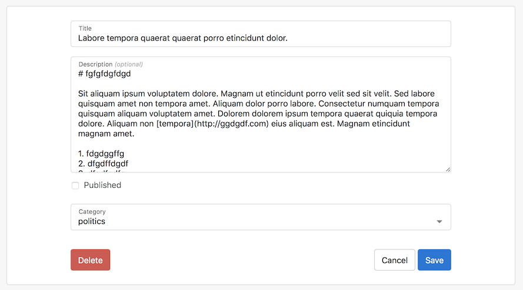

# Working with Forms

Arctic Forms, like the ListViews, add features not present in the standard 
django generics, there are three different views available: `CreateView`, 
`UpdateView` and `FormView`, they all share similar features.

It is recomended to use the project created in the [Lists](lists.md) chapter as
a base to try the examples on this one.

## Actions

By default the Forms include a `Submit` button, but more can be added by using 
the `actions` property, for example:

    actions = [
        ('Delete', ('articles:delete', 'pk'), 'left'),
        ('Cancel', 'cancel'),
        ('Save', 'submit'),
    ]

A default submit button is added if no button of the type 'submit' is provided,
in the case above `Save` will replace the default submit button.
The format of actions is a list of tuples:

    [('Label', 'named_url|cancel|submit', [extra parameters]), ...]

The optional third parameter can be either a string with 'left' to position the
button on the left side of the form, or a dictionary with the keys:
    
    'style': 'primary|secondary|danger' # secondary is default
    'id': 'some-id' # an auto generated id is provided by default
    'position': 'left' # if the button should be on the left side of the form
    'form_action': 'named_url' # for multiple submit buttons a different url can
                               # be provided when the form is successfully 
                               # submitted.

To style the `Delete` button as danger and keep its left position:

    ('Delete', ('articles:delete', 'pk'), {'position': 'left', 'style': 'danger'})

## Layouts

By default forms display one field per row, but this can be customized without
creating a new template by adding a layout property to either `FormView`, 
`UpdateView` or `CreateView`.

To set the published field next to the title field, go to `articles.views.py` 
and add the following layout property:

layout = [
    ('title', 'is_published'),
    'description',
    'category',
]

Adding a tuple around 2 or more fields will put them in the same row, by default
the total length of the row will be evenly distributed, but it is also possible
to 

## Inlines

## Widgets